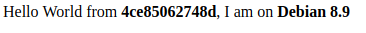
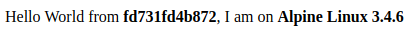
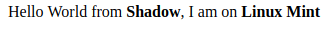

# Node Docker Hello World

A node app that displays the current OS and distribution that it is running on.

**Debian**

`docker run -it -p 8000:8080 patrickrainier/node-docker`

**Alpine**

`docker run -it -p 8081:8080 patrickrainier/node-docker:alpine`

**Local**

`yarn start`

